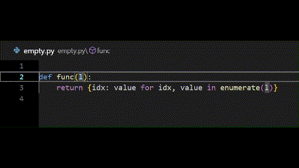
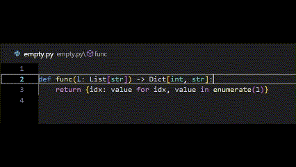

# Very Import-ant

## Never write import statements again

The purpose of this extension is to completely remove the requirement
for users to manually add import statements to individual files.

Simply configure the imports you use (e.g. `import pandas as pd`)
and then those imports will be added whenever the respective variable reference (e.g. `pd`) is in your Python file.

## Don't Other Extensions Do This?...Not Quite

Existing Python language server extensions (e.g. Pylance) implement
auto-importing to some extent, but with a few notable drawbacks:

1. The auto-import functionality requires the language server to
create a drop-down, which occasionally takes a while to load (frequently
it would have been quicker for a user to navigate to the top of the
file and just add the import line manually).

1. The user has to accept a selection from the drop-down, which is an interruption
to the typing flow (albeit a somewhat small one, but one nonetheless).

1. Most (all?) of the existing Python language server extensions for VS Code
(specifically Pylance) don't allow customizing auto-import aliases.
Instead they only support a fixed set of ones (e.g. `pd` for pandas, `np` for
numpy, etc.).

1. Existing Python language server extensions only allow you to auto-import
as you are typing. They currently do not automatically fix known undefined
variables elsewhere in the file. No existing formatters appear to fully
support this either.

This extension aims to solve all of the above problems by providing
functionality to automatically add imports while you are typing and
without *any* interruption to your development flow.

## Examples

### Add type annotation imports as you type



### Add libraries as you type


### Add imports on file save



## Setup

1. Install this extension

1. Add the following to your `settings.json`:
    ```json
    {

      // Setting to enable this formatter
      "very-import-ant.format.enable": true,

      // If editor.formatOnType is true, these characters will be all characters
      // that trigger an import check/addition.
      "very-import-ant.onTypeTriggerCharacters": "\n \t,",

      // Python settings
      "[python]": {
        "editor.defaultFormatter": "groogle.very-import-ant",

        // If you want the imports to be added as you type
        "editor.formatOnType": true,
        // If you want the imports to be added when you save the file
        "editor.formatOnSave": true,
        // If you want the imports to be added whenever you paste something into your editor
        "editor.formatOnPaste": true,
      },

      // Notebook settings
      "notebook.defaultFormatter": "groogle.very-import-ant",
      "notebook.formatOnCellExecution": true,
      "notebook.formatOnSave.enabled": true,

      // Add the following setting if you want to specify your own list
      // of auto-import variables.
      // The ones listed below are all included by default.
      "very-import-ant.autoImports": [
        {
          "variable": "pd",
          "import": "import pandas as pd"
        },
        {
          "variable": "np",
          "import": "import numpy as np"
        },
        {
          "variable": "xr",
          "import": "import xarray as xr"
        },
        {
          "variable": "xrt",
          "import": "from xarray import testing as xrt"
        },
        {
          "variable": "Any",
          "import": "from typing import Any"
        },
        {
          "variable": "Callable",
          "import": "from typing import Callable"
        },
        {
          "variable": "Dict",
          "import": "from typing import Dict"
        },
        {
          "variable": "List",
          "import": "from typing import List"
        },
        {
          "variable": "Union",
          "import": "from typing import Union"
        },
        {
          "variable": "Optional",
          "import": "from typing import Optional"
        },
      ],
    }
    ```

1. [Only relevant if `editor.formatOnType` is true]: Ensure Pylance doesn't hijack on-type formatting by following the instructions [here](./docs/troubleshooting.md#editorformatontype-not-working).

## Using with Other Formatters

While this extension is technically a formatter extension, it really
only does a very narrow scope of formatting. In order to use this
extension in conjunction with another formatter use the
[Multiple Formatters Extension](https://marketplace.visualstudio.com/items?itemName=Jota0222.multi-formatter).

## Troubleshooting

See [the troubleshooting doc](./docs/troubleshooting.md) for info on known issues and fixes.

## Contribute

Feel free to
[open issues](https://github.com/leep-frog/very-import-ant/issues) or
[pull requests](https://github.com/leep-frog/very-import-ant/pulls),
and I'll do my best to respond in a timely manner.

## Appreciate

I find it very rewarding to know that my projects made someone's day or
developer life a little better. If you feel so inclined,
[leave a review](https://marketplace.visualstudio.com/items?itemName=groogle.very-import-ant&ssr=false#review-details)
or [buy my a coffee](https://paypal.me/sleepfrog) so I know my project helped
you out!
